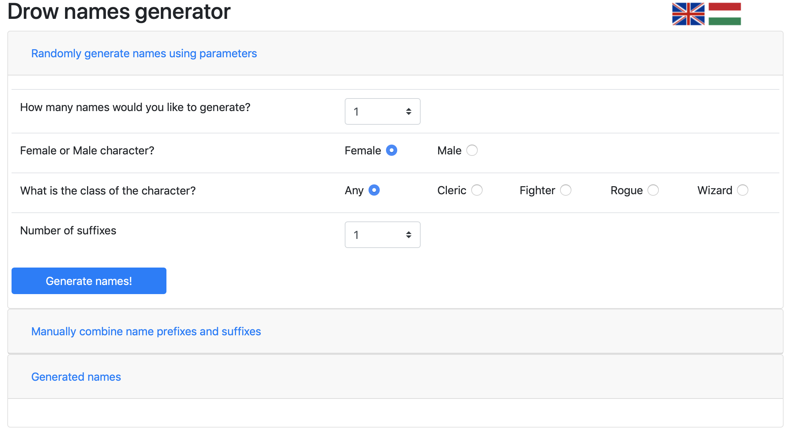
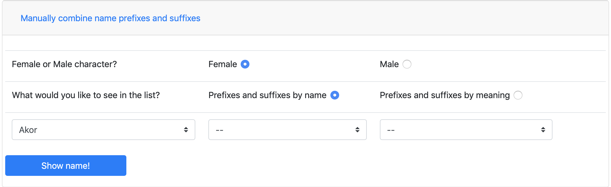
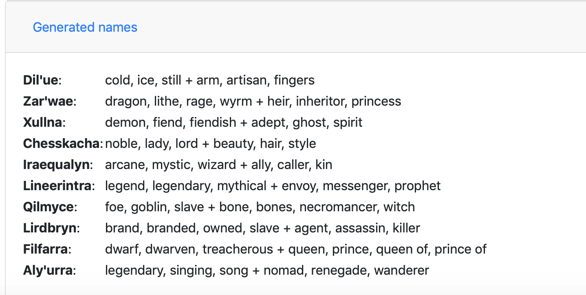
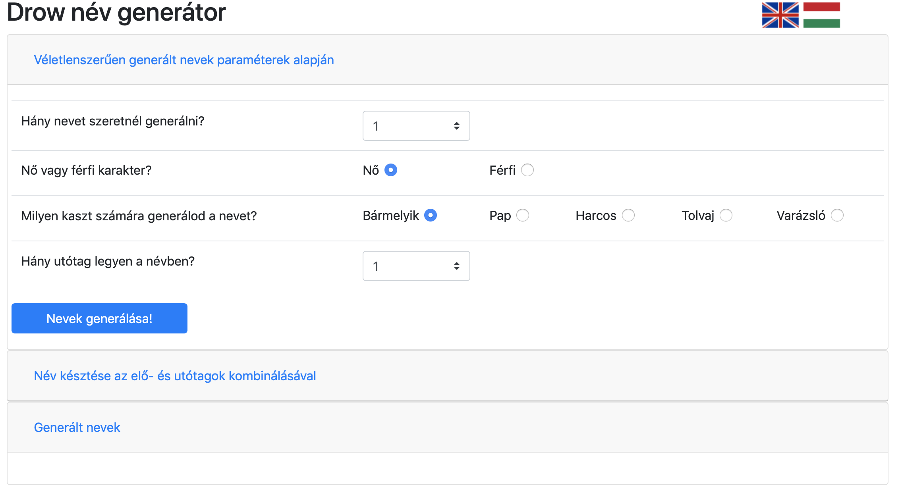

# DrowNameGenerator

[A magyar nyelvű instrukciókért görgess lentebb]

### Description
A HTML/Javascript application that allows you to randomly generate drow names for your Dungeons and Dragons game. The application currently supports English and Hungarian languages.

### How to install?
1. Click on the clone or download button at the upper right corner of the screend and select Download ZIP.
2. Find the DrowNameGenerator folder in your local downloads and within that double click on drownames.html (this will start the application in your browser)

# DrowNameGenerator

### Leírás
Egy HTML/Javascript alkalmazás, mely segítségével drow (sötét elf) neveket generálhatsz a Dungeons and Dragons játékaidhoz. Az alkalmazás jelenleg angol és magyar nyelven érhető el.

### Hogyan telepítsd?
1. Kattints a jobb felső sarokban lévő zöld "clone or download" gombra és válaszd a Download ZIP opciót.
2. Ezt követően keresd meg a DrowNameGenerator mappát a helyi letöltések között. Ebben a mappában fogod megtalálni a drownames.htlm fájlt, melyre duplán kattintva a böngésződben elindul az alkalmazás.
